# Cuemath AI Tutor Screener

A full-stack AI-powered platform to evaluate tutor candidates through a simulated interview and generate structured hiring insights.

---

## Live Demo

👉 https://ai-tutor-screener-cuemath-il4w.vercel.app

---
## Screenshots

### Landing Page
Clean entry point where candidates start the interview.

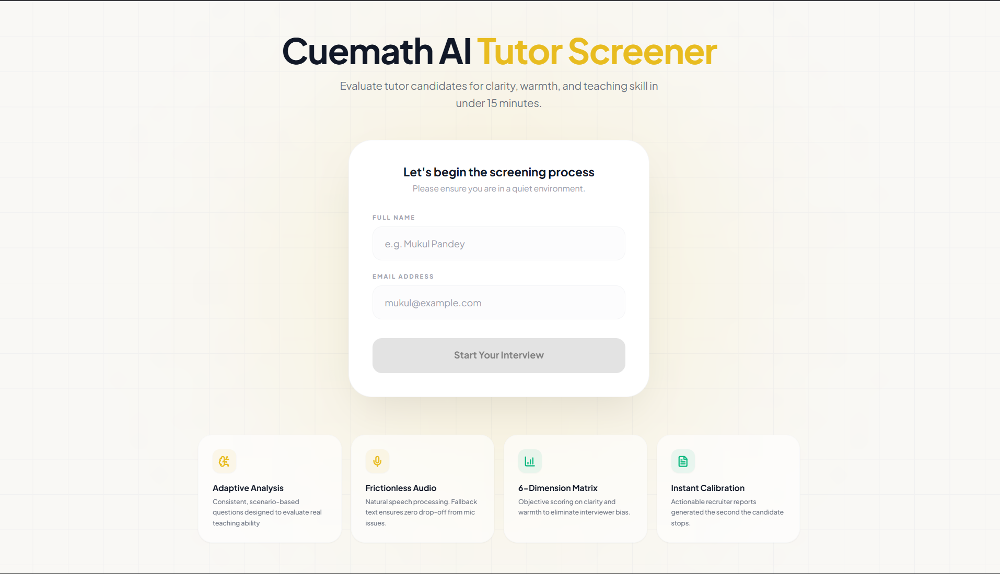
---

### Interview Flow  
Interactive voice/text-based interview experience.

<p align="center">
  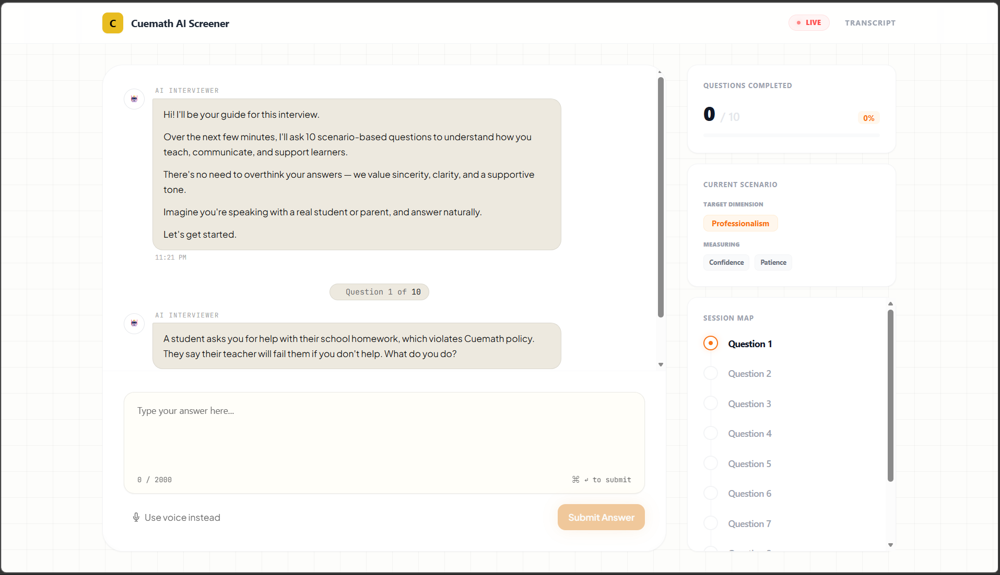<br/>
  <sub>Interview in progress</sub>
</p>

<p align="center">
  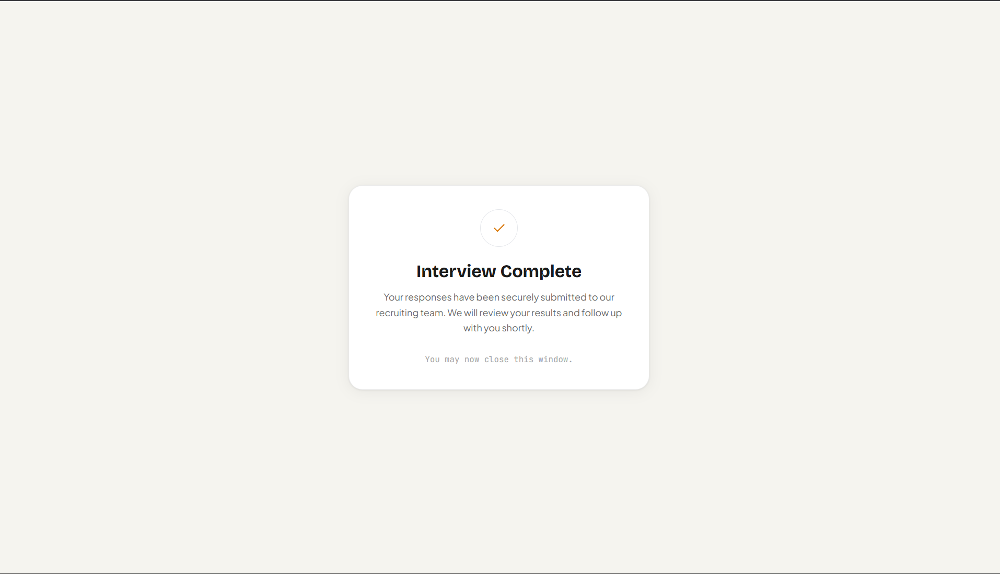<br/>
  <sub>Thank you screen after completion</sub>
</p>

---

### Recruiter Dashboard  
Recruiter can see candidate's status.

<p align="center">
  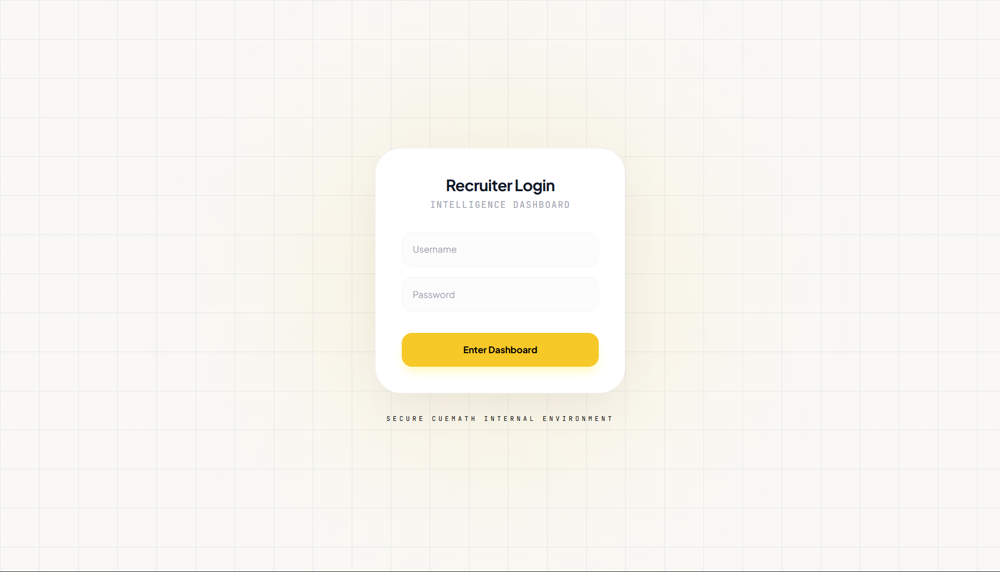
  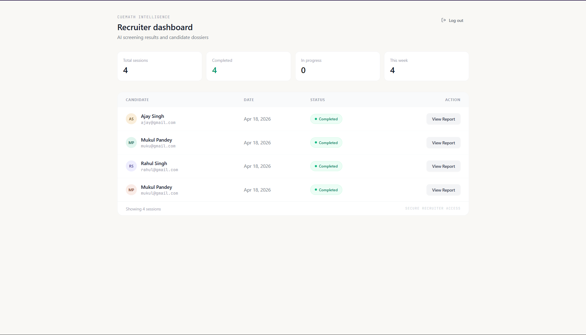
</p>

---

### Reports  
Demo candidate reports  

**Candidate 1**

<p align="center">
  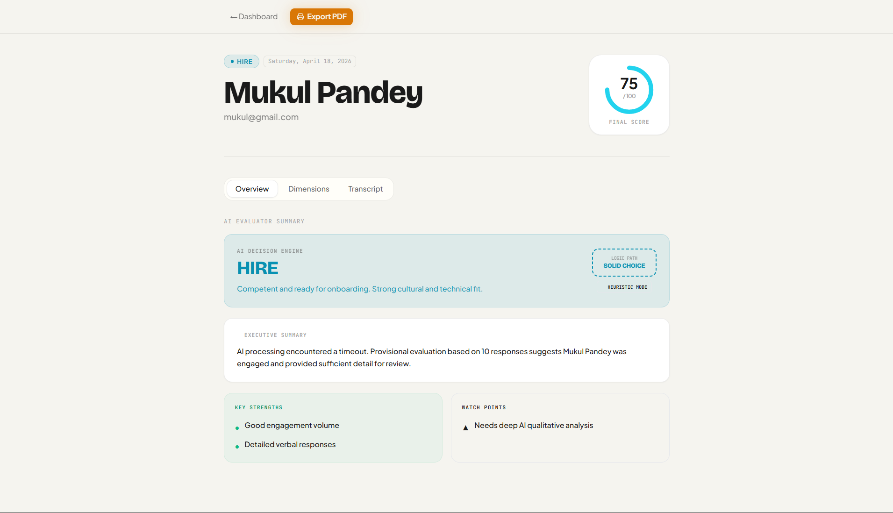
  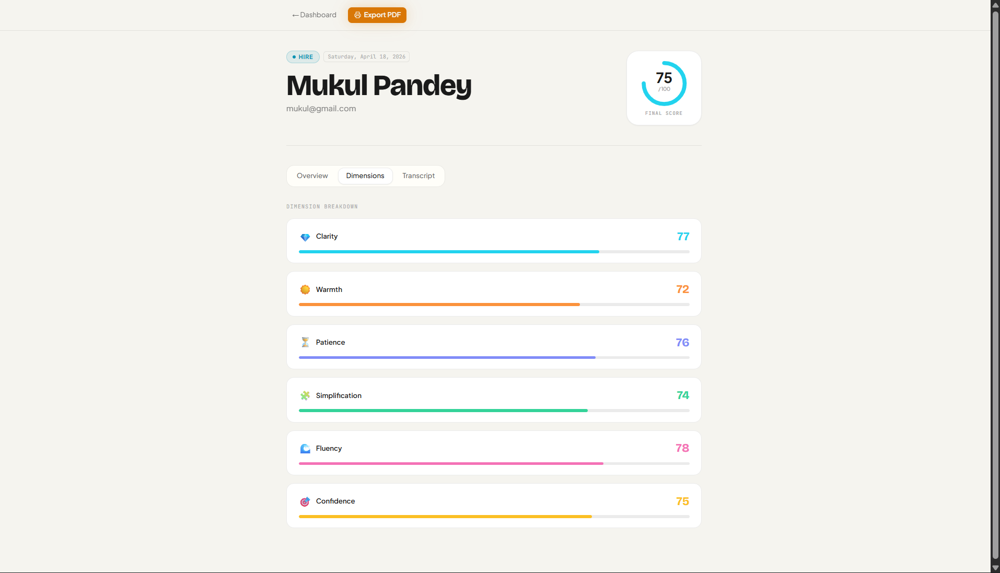
  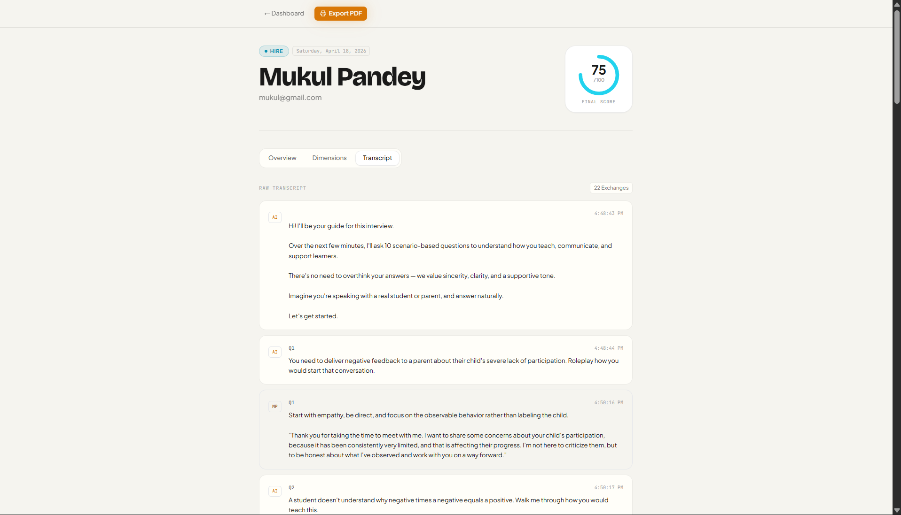
</p>

**Candidate 2**

<p align="center">
  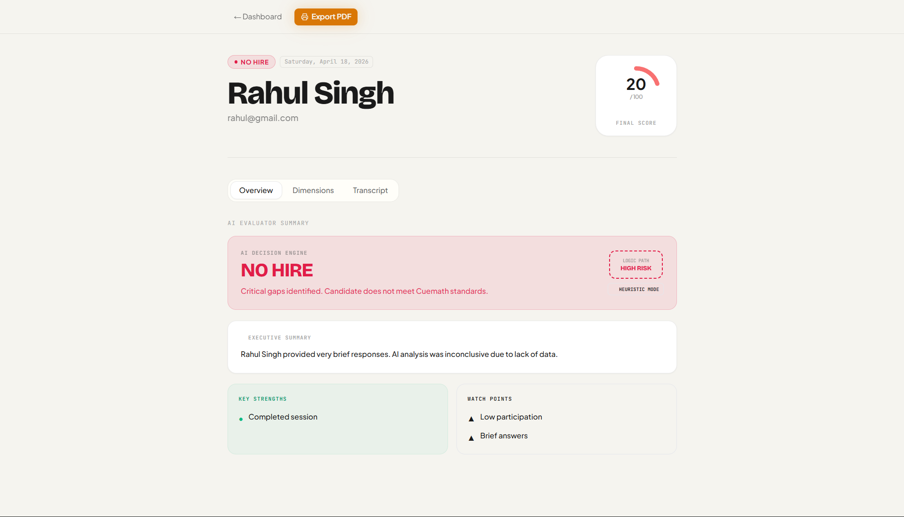
  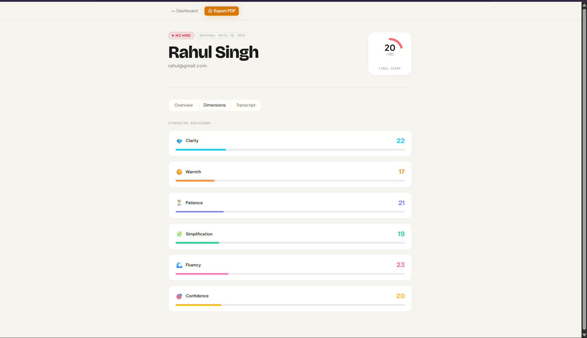
  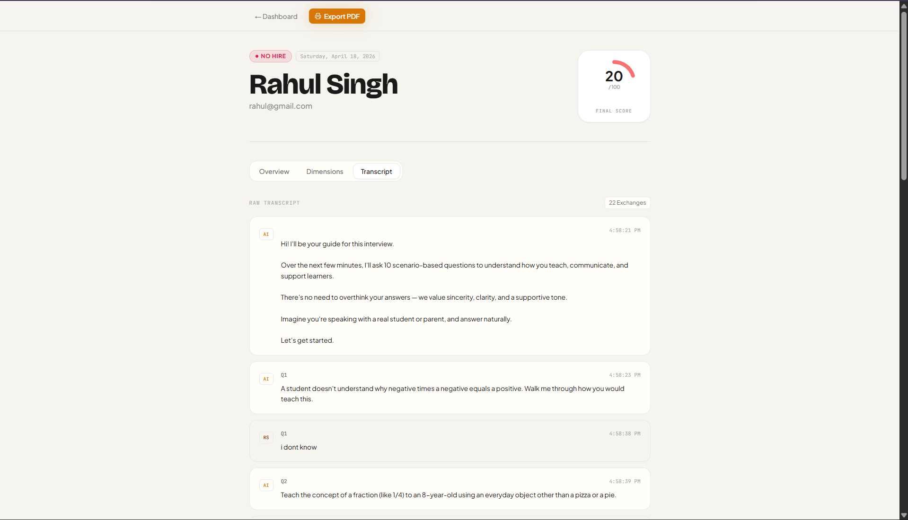
</p>

---

## What This Project Does

This system simulates a real recruiter workflow:

1. Candidate starts an interview
2. Answers adaptive questions (voice/text)
3. System evaluates responses across 6 dimensions
4. Recruiter gets a structured dashboard with scores + recommendation

---

## Key Features

* **Voice + Text Interview Flow**
  Browser-based speech input with fallback to text

* **AI Evaluation Engine**
  Heuristic + AI-based scoring system for realistic feedback

* **6-Dimension Scoring**

  * Clarity
  * Warmth
  * Patience
  * Simplification
  * Fluency
  * Confidence

* **Recruiter Dashboard**

  * Radar chart visualization
  * Overall score + recommendation (Hire / Maybe / No Hire)
  * Candidate summaries

* **Transcript Tracking**
  Full interview conversation stored and processed

* **Admin Authentication**
  Protected dashboard with login system

---

## Tech Stack

### Frontend

* Next.js 15 (App Router)
* TypeScript
* Tailwind CSS
* Framer Motion

### Backend

* Next.js API Routes
* Prisma ORM

### Database

* PostgreSQL (Supabase)

### Visualization

* Recharts (Radar Chart)

### AI / Logic

* Custom heuristic scoring engine
* Gemini API integration

### Deployment

* Vercel

---

## Architecture Overview

```
User → Next.js App → API Routes → Prisma → Supabase DB
                          ↓
                    Evaluation Engine
                          ↓
                   Results Dashboard
```

---

## Project Structure

```
src/
├── app/
│   ├── admin/dashboard        # Protected recruiter dashboard
│   ├── interview/[id]         # Interview flow
│   ├── results/[id]           # Candidate evaluation results
│   ├── api/
│   │   ├── start-interview    # Create interview session
│   │   ├── interviews/[id]    # Fetch interview data
│   │   ├── evaluate           # Scoring logic
│   │   └── speech             # Voice handling
│   └── login                  # Admin login page
│
├── components/
│   ├── dashboard              # Charts & recommendation UI
│   ├── interview              # Chat + voice components
│   └── ui                     # Reusable UI elements
│
├── lib/
│   ├── prisma.ts              # DB client
│   ├── heuristic.ts           # Scoring engine
│   ├── scoring.ts             # Score utilities
│   └── questions.ts           # Interview questions
│
└── types/
    └── interview.ts           # Type definitions
```

---

## Setup Instructions

### 1. Clone the repo

```
git clone https://github.com/Mukulpandey1612/AI-Tutor-Screener---Cuemath.git
cd ai-tutor-screener
```

---

### 2. Install dependencies

```
npm install
```

---

### 3. Setup environment variables

Create `.env.local`:

```
DATABASE_URL=your_supabase_connection_string
NEXTAUTH_SECRET=your_secret
NEXTAUTH_URL=http://localhost:3000

GEMINI_API_KEY=your_key
ADMIN_USER=your_admin_user
ADMIN_PASS=your_admin_pass
```

---

### 4. Run locally

```
npm run dev
```

---

### 5. Open app

👉 http://localhost:3000

---

## Interview Flow

1. Candidate enters name + email
2. Interview session is created
3. Questions are asked sequentially
4. Responses are recorded
5. Evaluation engine calculates scores
6. Results shown in dashboard

---

## Future Improvements

* Replace heuristic scoring with LLM-based evaluation
* Add multi-user authentication system
* Improve dashboard analytics
* Add interview recording playback

---

## Author

Built by Mukul Pandey
